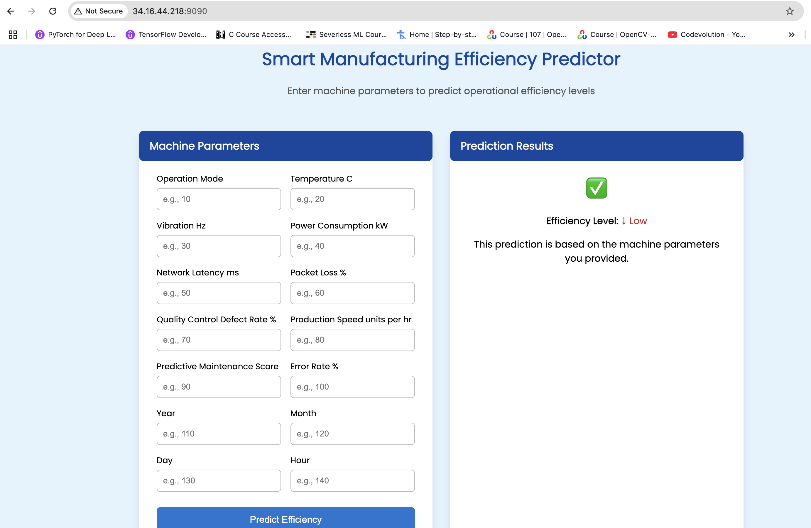
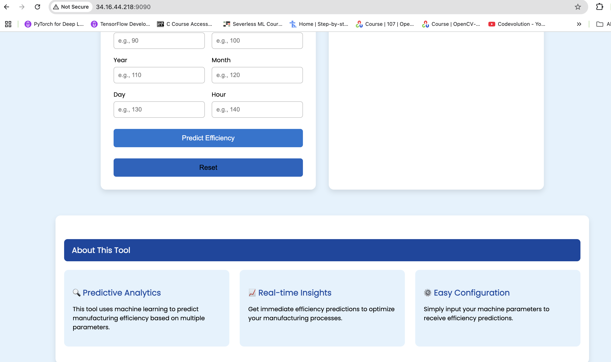
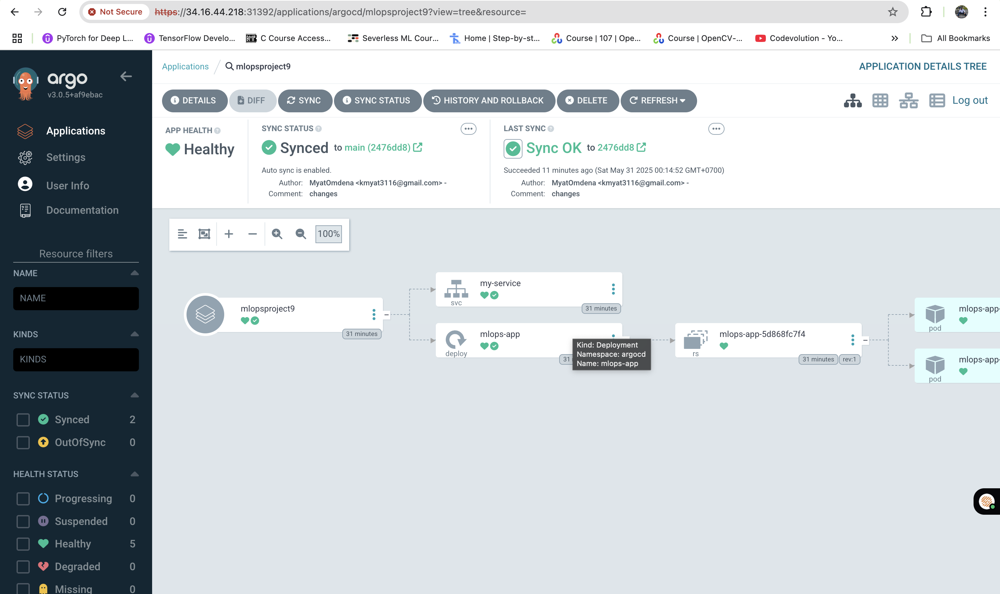
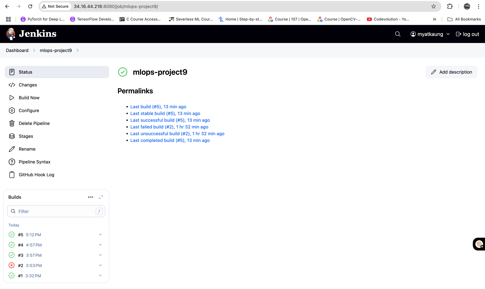

# 🏭 Smart Manufacturing Machines Efficiency Prediction

This repository contains the implementation of a **Smart Manufacturing Machines Efficiency Prediction system** using modern DevOps and MLOps practices. The primary goal is to predict the operational efficiency levels of manufacturing machines based on various input parameters.

## 🎯 Project Objective

To build an automated ML pipeline that predicts machine efficiency levels using historical data and integrates with CI/CD workflows for continuous deployment. The system will:

- Predict machine efficiency based on multiple input parameters.
- Provide real-time insights to optimize manufacturing processes.
- Be deployable as a user-friendly Flask web application.
- Automate the deployment process using GitOps principles.

## 📌 Project Highlights

- ✅ Local Kubernetes setup using Minikube  
- 🐳 Dockerization and container management  
- 🔧 Continuous Integration (CI) using Jenkins  
- 🔄 Continuous Deployment (CD) using ArgoCD  
- 🚀 GitHub integration for version control and automation  
- 💻 User-friendly Flask-based web app for predictions  
- ☁️ Google Cloud VM instance setup for production deployment  

## 📂 Dataset

- **Source**: Internal or synthetic dataset (details not disclosed)  
- **Details**: Contains features such as operation mode, temperature, vibration, power consumption, etc.  
- **Target**: Machine efficiency level (e.g., Low, Medium, High)

## 🧑‍💻 Tech Stack

- **Python**
- **Flask** (for building the web app)
- **Jupyter Notebook** (for initial testing and exploration)
- **Docker** (for containerization)
- **Kubernetes** (using Minikube for local development)
- **GitOps** (using ArgoCD for automated deployments)
- **Jenkins** (for CI/CD pipelines)
- **GitHub** (for code versioning and integration)

## 📋 Workflow Overview

The project follows a comprehensive workflow from setup to deployment:

### 1. **Project Setup**
   - Define folder structure, virtual environment, configuration files, and custom modules.

### 2. **Jupyter Notebook Testing**
   - Initial testing and exploration of the dataset using Jupyter Notebooks.

### 3. **Data Processing**
   - Clean, preprocess, and engineer features for model training.

### 4. **Model Training and Training Pipeline**
   - Train and validate machine learning models for efficiency prediction.
   - Automate the training pipeline using tools like DVC or MLflow.

### 5. **User App Building using Flask**
   - Build a Flask-based web application for user interaction.

### 6. **Data & Code Versioning**
   - Use Git for version control.
   - Create Dockerfiles and Kubernetes manifests for deployment.

### 7. **Google Cloud VM Instance Setup and Minikube Configurations**
   - Set up a Google Cloud VM instance for production deployment.
   - Configure Minikube for local Kubernetes development.

### 8. **Jenkins Installation and Configuration on VM**
   - Install and configure Jenkins on the Google Cloud VM.
   - Set up Jenkins jobs for continuous integration.

### 9. **GitHub Integration with Jenkins**
   - Integrate GitHub with Jenkins for automated builds and tests.

### 10. **CI Pipeline (Continuous Integration)**
   - Implement a Jenkins pipeline for automated testing and building.

### 11. **ArgoCD Installation and Configuration**
   - Install and configure ArgoCD for GitOps-based deployments.

### 12. **CD Pipeline (Continuous Deployment)**
   - Automate the deployment process using ArgoCD.
   - Trigger deployments via Webhooks when new code is pushed to GitHub.

### 13. **Full CI-CD Automation**
   - Combine Jenkins and ArgoCD for end-to-end CI/CD automation.
   - Use Webhooks to trigger builds and deployments seamlessly.

## 📸 Web Application Preview

Below are previews of the Flask-based web application interface:

*Screenshot of the user interface for predicting machine efficiency.*

*Detailed view of the prediction results.*

## 🚀 CI/CD Pipeline Status

The following images show the status of the CI/CD pipelines:

*Status of the ArgoCD deployment pipeline.*

*Status of the Jenkins CI pipeline.*

### Key Features:
- **Predictive Analytics**: Uses machine learning to predict efficiency based on multiple parameters.
- **Real-time Insights**: Provides immediate efficiency predictions to optimize manufacturing processes.
- **Easy Configuration**: Simple input fields for machine parameters to receive efficiency predictions.
